# Geometric Modeling — Mesh Viewer (TP1)

Visualiseur de maillages basé sur une structure de données **half-edge**, écrit en C++ /
OpenGL. Le projet permet de charger des fichiers `.obj`, de les afficher de différentes
manières (mesh, fil de fer, normales, silhouette) et d'appliquer plusieurs opérations
géométriques (triangulation, surface de révolution, simplification…).

> Le menu principal s'ouvre par un **clic droit** dans la fenêtre. Les compteurs
> *Vertices / Halfedges / Faces* affichés en bas à gauche permettent de vérifier l'effet
> de chaque opération.

---

## Compilation & exécution

```bash
cd TP1/MeshViewerCMake
cmake -S . -B build
cmake --build build
cd build && ./MeshViewer
```

Dépendances : **OpenGL**, **GLEW**, **GLM**, **GLUT**.
Sous macOS (Homebrew) : `brew install glew glm`. Sous Linux/Windows : `freeglut` en plus.

---

## État des objectifs

| Objectif | État | Capture |
|---|---|---|
| `readFile` (chargement `.obj`) | ✅ Fait | ✔ |
| `computeNormals` | ✅ Fait | ✔ |
| Silhouette | ✅ Fait | ✔ |
| Triangulation — faces **convexes** | ✅ Fait | ✔ |
| Triangulation — faces **concaves** | ✅ Fait (*ear clipping*) | ✔ |
| Triangulation — polygones à **trous** (expert, optionnel) | ❌ Non traité | — |
| Tests de la structure half-edge | ✅ Fait (`checkMesh`) | — |
| Surface de révolution | ✅ Fait | ✔ |
| Simplification (*shortest edge collapse*) | ✅ Fait | ✔ |
| Subdivision Catmull-Clark | ✅ Fait | ✔ |

---

## Détail des méthodes

### `readFile` — chargement d'un maillage `.obj`

Lecture ligne par ligne du fichier : les sommets (`v`) deviennent des `myVertex`, et chaque
face (`f`) crée ses demi-arêtes. Les **twins** sont reconstruits à la volée grâce à une
`map<pair<int,int>, myHalfedge*>` : quand l'arête `(b, a)` existe déjà, on la relie à `(a, b)`.
Le maillage est ensuite recentré et mis à l'échelle par `normalize()`.

Le chargement se fait au démarrage (`apple.obj`) ou via le menu **Open File**.

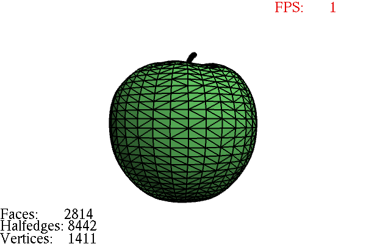

---

### `computeNormals`

Calcule d'abord la normale de chaque face, puis la normale de chaque sommet (moyenne des
faces adjacentes parcourues via la structure half-edge). Les normales par sommet servent au
*smooth shading*, celles par face au *flat shading*.

Ci-dessous : ombrage lissé + affichage des normales par sommet (menu **Normals**).

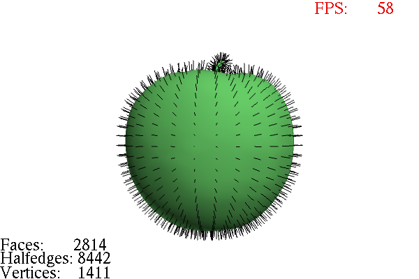

---

### Silhouette

Une arête est une arête de silhouette si elle sépare une face tournée **vers** la caméra
d'une face tournée **dos** à la caméra. On le détecte en comparant le signe du produit
scalaire entre la direction caméra→arête et les normales des deux faces adjacentes
(`res1 < 0 != res2 < 0`). Les arêtes trouvées sont tracées en rouge.

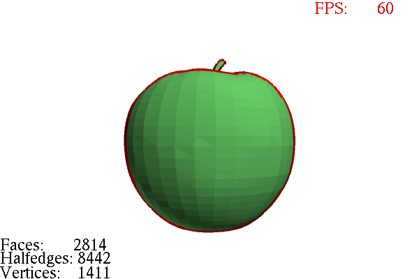

---

### Triangulation (*ear clipping*)

Algorithme de découpage d'oreilles, robuste aux faces **convexes comme concaves**. La normale
de la face est calculée par la formule de Newell, ce qui rend le test « l'oreille est-elle
convexe ? » et « contient-elle un autre sommet ? » valides en 3D quelle que soit l'orientation.

**Faces convexes** — un octogone découpé en triangles :

| Avant | Après |
|---|---|
| 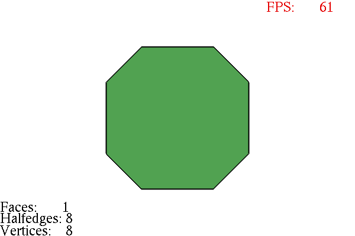 | 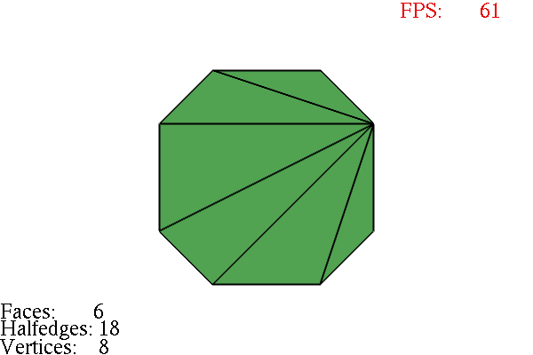 |

**Faces concaves** — *ear clipping* qui évite les oreilles non valides :

| Avant | Après |
|---|---|
| 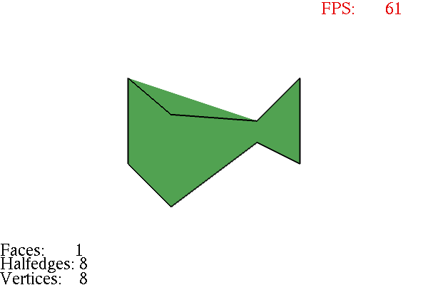 | 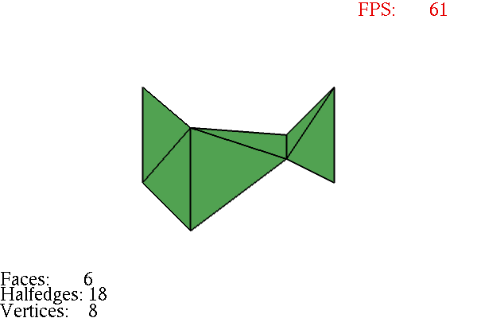 |

> Le cas **expert** (polygones avec trous) n'a pas été traité — il était optionnel.

---

### Tests de la structure half-edge

`checkMesh()` vérifie les principaux invariants de la structure à chaque chargement et après
les opérations : présence du **twin** (`twin->twin == h`, `twin != h`, `twin->source ==
next->source`), réciprocité des liens **next/prev**, cohérence de l'**adjacent_face** le long
de chaque boucle de face, et validité du champ **originof** des sommets. Le bilan est affiché
en console, en distinguant un maillage fermé valide d'un maillage ouvert (où seules les arêtes
de bord n'ont pas de twin).

Une petite suite de tests automatisés accompagne le projet :

```bash
cmake --build build --target MeshViewerTests
./build/MeshViewerTests
```

---

### Surface de révolution

`revolution()` génère un maillage en faisant tourner un profil 2D autour de l'axe Y
(20 tranches). Chaque couple (tranche, segment de profil) produit une face quadrilatère, et les
twins sont reliés via la même technique de `map` que `readFile`.

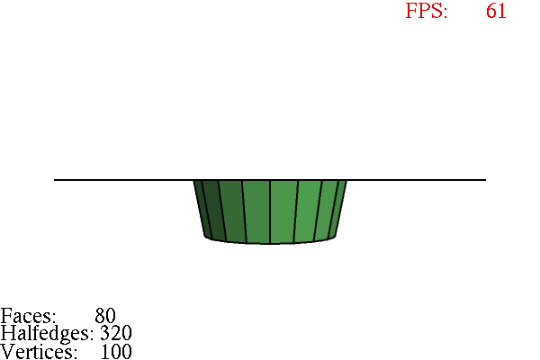

---

### Simplification — *shortest edge collapse*

À chaque itération on cherche **l'arête la plus courte**, on fusionne ses deux sommets en leur
milieu, puis on reconstruit proprement le maillage (faces dégénérées supprimées, twins
recalculés). Le menu **Simplification** réduit le maillage d'environ 10 % de ses faces par appel.

Exemple sur `gear.obj` (triangulé) après plusieurs passes — les compteurs en bas à gauche
montrent la diminution du nombre de faces :

| Avant | Après |
|---|---|
| 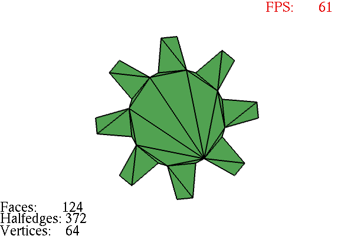 | 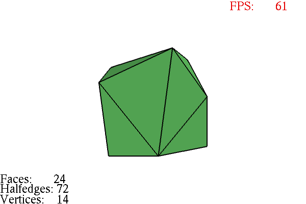 |

---

### Subdivision Catmull-Clark

`subdivisionCatmullClark()` raffine le maillage en suivant les trois règles classiques :

- **Face point** : barycentre des sommets de chaque face.
- **Edge point** : moyenne des deux extrémités de l'arête et des deux face points voisins
  (milieu de l'arête sur les bords).
- **Vertex point** : nouvelle position de chaque sommet d'origine,
  `(F + 2R + (n-3)P) / n`, où `F` est la moyenne des face points adjacents, `R` la moyenne
  des milieux d'arêtes incidentes, `P` l'ancienne position et `n` la valence (règle de bord
  dédiée pour les maillages ouverts).

Chaque face d'origine est remplacée par un quad par sommet, reliant *vertex point → edge point
→ face point → edge point précédent*. Chaque appel quadruple le nombre de faces. Sur un cube,
le maillage converge vers une surface lisse (6 → 24 → 96 → 384 faces) :

| Cube (départ) | 1 itération | 2 itérations | 3 itérations (lissé) |
|---|---|---|---|
| 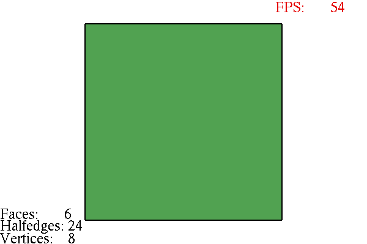 | 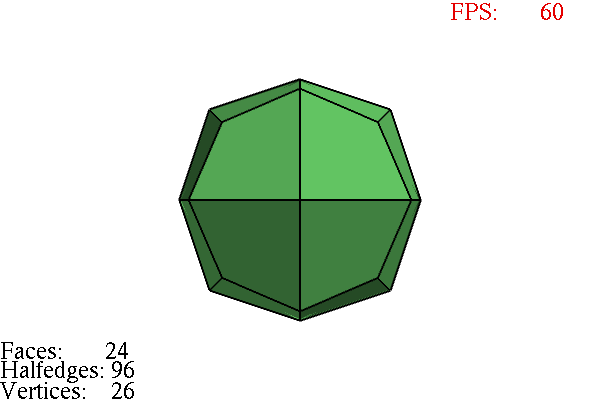 | 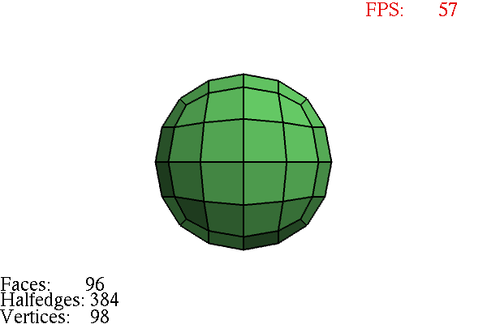 | 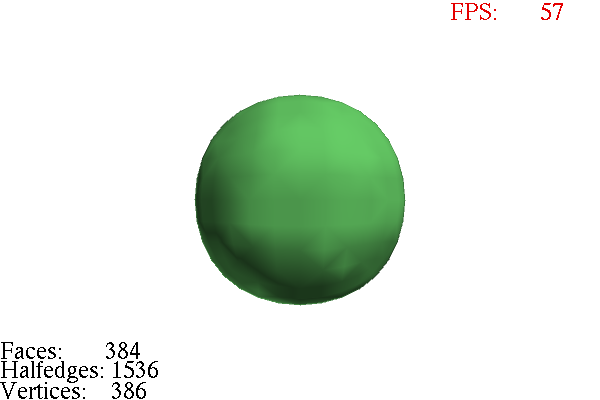 |

Le fil de fer de la résolution la plus fine (3 itérations, 384 faces, 386 sommets) confirme que
la topologie est régulière : une grille de quadrilatères propre, sans face dégénérée.

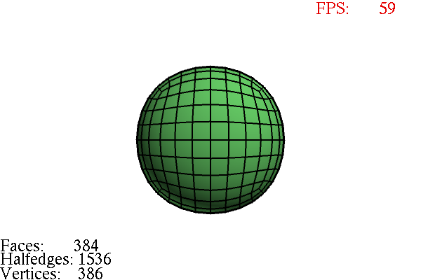

---

## Note sur l'utilisation de l'IA

Je développe sur **MacBook M1** et sur **Windows**. J'ai dû faire des choix de portabilité, et
j'ai choisi de travailler principalement sur **macOS**.

Le principal point de friction a été **OpenGL / GLUT sous macOS**, où j'ai rencontré quelques
bugs de compatibilité (2-3). L'IA m'a aidé à les corriger :

- **VAO sous macOS** : sur le profil de compatibilité Apple, `glGenVertexArrays` /
  `glBindVertexArray` / `glDeleteVertexArrays` ne sont pas disponibles tels quels. Il a fallu
  les rediriger vers leurs variantes `…APPLE` (voir le bloc `#if defined(__APPLE__)` en tête de
  `main.cpp`).
- **GLUT natif vs FreeGLUT** : sous macOS on lie le *framework* `GLUT` (Cocoa, sans X11), alors
  que sous Linux/Windows on utilise `freeglut`. Cette séparation est gérée dans le
  `CMakeLists.txt` (`if(APPLE) … else() …`).
- **GLEW via Homebrew** : chemins d'include et de lib pointés vers `/opt/homebrew`.
- **Boîte de dialogue d'ouverture de fichier** : sous macOS, `openFileDialog()` utilise
  `osascript` (AppleScript) pour afficher un sélecteur de fichiers natif.

Pour **le reste des exercices** (algorithmes de modélisation géométrique : half-edge,
*ear clipping*, révolution, simplification…), je me suis servi de l'IA **comme un outil et un
compagnon de travail**, à la manière d'un professeur particulier : pour **comprendre** les
algorithmes et leur logique. L'implémentation et les choix restent les miens.
